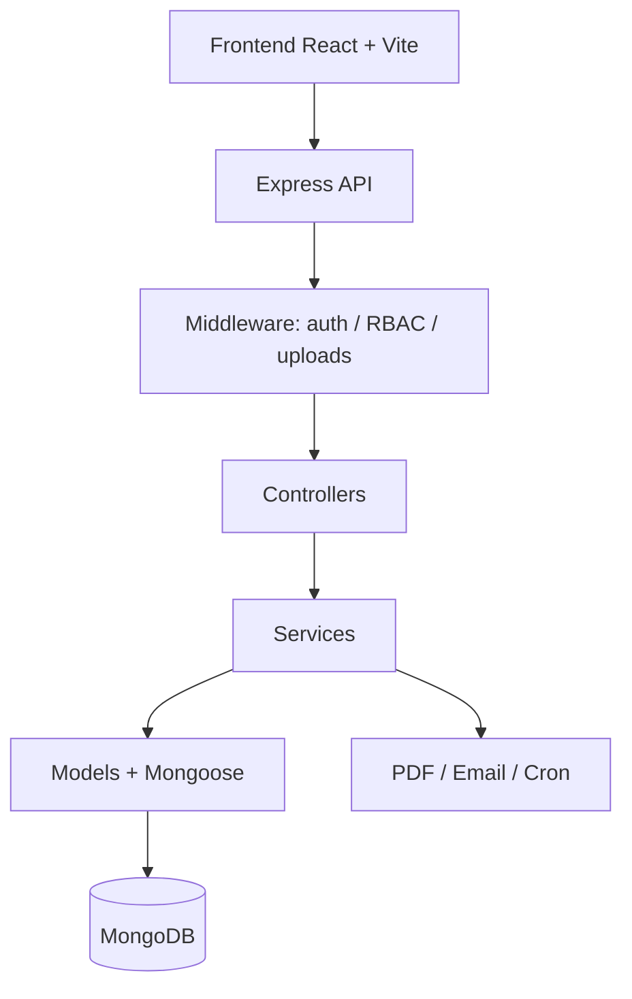

# Ohnix

<p align="center">
  <strong>Inventario, ventas y operaciones con trazabilidad total.</strong><br>
  Control, visibilidad y eficiencia para cada movimiento del negocio.
</p>

<p align="center">
  
  
  
  
</p>

<blockquote align="center">
  Ohnix centraliza inventario, compras, ventas, reportes y alertas para que el negocio opere con menos fricción y más precisión.
</blockquote>

---

## Snapshot

| Dimensión | Enfoque |
|---|---|
| Inventario | Stock en tiempo real, validaciones atómicas y control multiusuario |
| Operaciones | Compras, ventas, devoluciones y reportes en un solo flujo |
| Automatización | Alertas de bajo stock, OTP, PDFs e integración con correo |
| Seguridad | JWT, RBAC, cookies HTTP-only y aislamiento por usuario |

---

## Why It Feels Different

<table>
  <tr>
    <td width="50%"><strong>Control real de stock</strong><br>Las mutaciones de inventario usan validaciones atómicas y sesiones de MongoDB para evitar estados inconsistentes.</td>
    <td width="50%"><strong>Flujos completos</strong><br>Compras, órdenes, retornos y alertas se diseñaron como procesos operativos, no como CRUD aislado.</td>
  </tr>
  <tr>
    <td><strong>Arquitectura clara</strong><br>Controllers, services, models y middleware mantienen la lógica separada y fácil de extender.</td>
    <td><strong>Salida profesional</strong><br>PDF de facturas, carga masiva CSV y notificaciones por correo para cerrar el ciclo operativo.</td>
  </tr>
</table>

---

## Core Experience

- **Compras**: entrada de mercadería, control de estados y retorno parcial con trazabilidad.
- **Ventas**: creación de órdenes, deducción segura de stock y generación de factura PDF.
- **Productos**: catálogo con categorías, unidades, precios y carga masiva por CSV.
- **Reportes**: métricas para decisiones rápidas sobre ventas, compras y stock bajo.
- **Usuarios**: autenticación con verificación por OTP, roles y aislamiento por propietario.

---

## Architecture Flow



---

## Tech Stack

| Layer | Stack |
|---|---|
| Backend | Node.js, Express, ESM |
| Database | MongoDB, Mongoose |
| Auth | JWT, bcryptjs, OTP |
| Files | Multer, Cloudinary |
| Reports | PDFKit |
| Email | Nodemailer (Gmail SMTP) |
| Scheduling | node-cron, Vercel Cron |
| Frontend | React 18, Vite, React Router v7 |
| UI | Ant Design 5.x, Tailwind CSS 3.x |
| Charts | Recharts, @ant-design/plots |
| HTTP | Axios |

---

## API Overview

Base URL: `https://localhost:3001/api/v1`

```json
{
  "statusCode": 200,
  "data": {},
  "message": "Operation successful",
  "success": true
}
```

| Module | Route Prefix | Purpose |
|---|---|---|
| Auth | `/users` | Register, login, logout, OTP flows |
| Products | `/products` | Product CRUD and CSV bulk upload |
| Categories | `/categories` | User and admin category management |
| Units | `/units` | Measurement unit catalog |
| Customers | `/customers` | Customer profiles and uploads |
| Suppliers | `/suppliers` | Supplier data and banking info |
| Purchases | `/purchases` | Purchase orders and returns |
| Orders | `/orders` | Sales orders and invoice generation |
| Reports | `/reports` | Dashboard KPIs and analytics |
| Scheduler | `/scheduler` | Low-stock alert control |

---

## Data Model

| Model | Notes |
|---|---|
| User | Roles, refresh token, OTP fields |
| Category | Scoped by creator |
| Unit | Scoped by creator |
| Product | Stock, purchase and sale prices, tenant isolation |
| Customer | Contact and billing profile |
| Supplier | Commercial and banking profile |
| Purchase | Purchase number and status lifecycle |
| PurchaseDetail | Quantities, costs, and return tracking |
| Order | Invoice number and lifecycle |
| OrderDetail | Line items and totals |

---

## Getting Started

### Backend

```bash
cd Backend
npm install
npm run dev
```

Create `Backend/.env`:

```env
PORT=3001
MONGODB_URI=mongodb+srv://<user>:<pass>@cluster.mongodb.net
NODE_ENV=development

ACCESS_TOKEN_SECRET=<secret>
ACCESS_TOKEN_EXPIRY=1d
REFRESH_TOKEN_SECRET=<secret>
REFRESH_TOKEN_EXPIRY=10d

CLOUDINARY_CLOUD_NAME=<name>
CLOUDINARY_API_KEY=<key>
CLOUDINARY_API_SECRET=<secret>

SENDER_EMAIL=<gmail>
SENDER_PASSWORD=<app-password>

FRONTEND_URL=http://localhost:5173
TIMEZONE=Asia/Kolkata
```

### Frontend

```bash
cd Frontend
npm install
npm run dev
```

## Free Deployment

This repo is prepared for a low-cost setup:

- Frontend: Vercel free tier.
- Backend: Render free tier or Railway free tier.
- Database: MongoDB Atlas free tier.

For Vercel, import the repository at the root and keep the default root config. The app builds the React frontend from `Frontend/` and expects the backend URL in `VITE_BACKEND_URL`.

For the backend, `render.yaml` is already included at the repo root so Render can deploy the `Backend/` service directly.

Production env vars for the frontend:

```env
VITE_BACKEND_URL=https://<your-backend-domain>
```

Production env vars for the backend should point to Atlas and your frontend domain:

```env
MONGODB_URI=<atlas-connection-string>
FRONTEND_URL=https://<your-vercel-domain>
NODE_ENV=production
START_SCHEDULER=true
ALLOWED_ORIGINS=https://<your-vercel-domain>
```

---

## Why It Feels Fast

- Atomic stock updates prevent overselling.
- Service-layer transactions keep multi-step operations consistent.
- Bulk upload returns partial success instead of failing everything.
- Scheduled alerts keep inventory visible without manual checks.

---

## Future Work

- Idempotency keys for repeat-safe order creation.
- Redis locking for higher throughput stock operations.
- Audit logs for every state transition and stock mutation.
- Rate limiting on auth and OTP endpoints.

---

## Contact

**GitHub**: [AleRxJ/Ohnix](https://github.com/AleRxJ/Ohnix)  
**Email**: alejandrosoftware.engineering@gmail.com

<p align="center">
  Made with care by <strong>Alejandro Vallejo</strong> · Ohnix API v1.0.0
</p>
